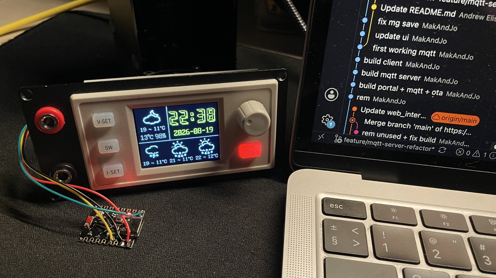

# XY-SK120 / XY-SK150 Power Supply Control (Local Panel + MQTT)


Control an XY-SK120 / XY-SK150(S) power supply (and compatible models) over Modbus RTU using a Seeed XIAO ESP32S3 or ESP32C3.

The firmware hosts its own **local panel** (served by the device over HTTP + WebSocket) and can optionally publish live status to any **MQTT broker** (e.g. the Home Assistant mosquitto add-on) for control and history graphs. No external server required.

## Architecture

```
+----------------+   HTTP :80 + WS /ws   +----------------+
|  Firmware      | <--------------------> |  Browser       |
|  (ESP32)       |    local panel         |  client        |
+----------------+                        +----------------+
     |
     | MQTT (TCP 1883, optional)
     v
+----------------+
|  MQTT broker   |  e.g. mosquitto in Home Assistant
|  (external)    |
+----------------+
```

- **Local panel** — the device serves the single-page UI over HTTP (`/`) and streams live status + accepts commands over **WebSocket** (`/ws`). Reachable on the LAN IP, or from the provisioning AP (`XY-SK150-Setup`, 192.168.4.1).
- **MQTT (optional)** — when enabled in the panel and a broker host is set, the device connects to the broker, publishes retained `xysk/<deviceId>/status` (live values), `xysk/<deviceId>/online` (LWT) and `xysk/<deviceId>/info`, subscribes to `xysk/<deviceId>/command` and answers on `xysk/<deviceId>/response`. Empty username/password = anonymous connect.
- **Home Assistant** — point an MQTT sensor/switch/number at those topics (see below) to get control + history graphs without any server.

## Features

- **Local control panel** — output on/off, V/A/W set, CV/CC/CP, key lock, protections (OVP/OCP/OPP/OTP/LVP), memory groups, beeper, backlight, sleep, timezone, PSU reset, WiFi + MQTT settings. Data flows over WebSocket (no HTTP polling).
- **On-device graphs** — the main page draws a live chart of voltage/current/power (+ optional Ah/Wh/temperature) from a RAM ring buffer sampled every 5 s (~1 hour), reset manually from the panel. No external chart library, drawn on canvas.
- **MQTT publish** — optional, toggleable in the panel; requires at least a broker IP. Supports username/password.
- **RTC / weather sync** — every ~10 s the ESP32 pushes Unix time plus a 3-day Open-Meteo forecast into the PSU's screensaver (register block `0x0200–0x0214`, same frame the OEM XY-WFPOW module sends)
- **Serial monitor control interface** — menus for basic control, measurement, protection, settings, memory groups, WiFi, MQTT and register debugging
- **Register debugging** — scan/compare/sniff tools to discover undocumented registers (see below)
- **OTA updates** — dual app partitions + ArduinoOTA/espota on both targets; no USB needed after the first flash
- ESP32S3 and ESP32C3 targets

## Hardware Setup

- Connect the XIAO ESP32 to the XY-SK120/SK150 using the TTL interface:
  - XIAO TX pin → XY-SK120 RX pin
  - XIAO RX pin → XY-SK120 TX pin
  - XIAO GND → XY-SK120 GND
- First boot opens a provisioning AP (`XY-SK150-Setup`, http://192.168.4.1) where you enter your WiFi credentials; the same panel is then served on the LAN IP. Holding the WiFi reset pin (D0 on ESP32S3, GPIO9 on ESP32C3) to ground for 3 s resets the WiFi settings.

## First run

1. Build & flash the firmware over USB once (see [Building](#building)).
2. Connect to the `XY-SK150-Setup` AP (or use the LAN IP), open the panel.
3. Open **Настройки → MQTT**, enter the broker IP/port (optionally login/password), tick «Подключаться к брокеру», save.

## Home Assistant integration

The device publishes everything under `xysk/<deviceId>/...` (`deviceId` = `dev_<last6 MAC>`, shown in the panel). Add an MQTT broker in HASS pointing at your mosquitto.

**Auto-discovery (recommended):** on every broker connect the device publishes
Home Assistant MQTT discovery configs under `homeassistant/*/xysk_<deviceId>_*/config`
(sensors for voltage/current/power/energy/temps/mode, switches for the output and
key lock, numbers for V-set/I-set/P-set). All entities group under one device —
no YAML needed.

Manual YAML (only if you disable/ignore discovery), e.g.:

```yaml
mqtt:
  sensor:
    - name: "PSU Voltage"
      state_topic: "xysk/dev_18C150/status"
      value_template: "{{ value_json.voltage }}"
      unit_of_measurement: "V"
      device_class: voltage
      state_class: measurement
    - name: "PSU Current"
      state_topic: "xysk/dev_18C150/status"
      value_template: "{{ value_json.current }}"
      unit_of_measurement: "A"
      device_class: current
      state_class: measurement
    - name: "PSU Power"
      state_topic: "xysk/dev_18C150/status"
      value_template: "{{ value_json.power }}"
      unit_of_measurement: "W"
      device_class: power
      state_class: measurement
    - name: "PSU Amp-hours"
      state_topic: "xysk/dev_18C150/status"
      value_template: "{{ value_json.ampHours }}"
      unit_of_measurement: "Ah"
      state_class: total_increasing
    - name: "PSU Watt-hours"
      state_topic: "xysk/dev_18C150/status"
      value_template: "{{ value_json.wattHours }}"
      unit_of_measurement: "Wh"
      state_class: total_increasing
  switch:
    - name: "PSU Output"
      state_topic: "xysk/dev_18C150/status"
      value_template: "{{ value_json.outputEnabled | bool }}"
      command_topic: "xysk/dev_18C150/command"
      payload_on: '{"action":"powerOutput","enable":true}'
      payload_off: '{"action":"powerOutput","enable":false}'
  number:
    - name: "PSU V-set"
      command_topic: "xysk/dev_18C150/command"
      command_template: '{"action":"setVoltage","voltage":{{ value }}}'
      min: 0
      max: 150
      step: 0.01
      unit_of_measurement: "V"
    - name: "PSU I-set"
      command_topic: "xysk/dev_18C150/command"
      command_template: '{"action":"setCurrent","current":{{ value }}}'
      min: 0
      max: 65
      step: 0.001
      unit_of_measurement: "A"
```

`state_class: measurement` / `total_increasing` is what makes HASS record history and draw graphs.

## RTC & Weather Sync

- **Time**: NTP sync + timezone, pushed as local Unix time to `0x0200–0x0201` every ~10 s.
- **Weather**: a background task fetches current conditions + 3-day forecast from Open-Meteo (default location is Tyumen, RU; override via `setWeatherMeteoConfig(lat, lon)`), maps the WMO codes onto the PSU's screensaver icon set and writes the block `0x0203–0x0214`.
- The whole 21-register block `0x0200–0x0214` is written with one Modbus function 0x10 request, mirroring the OEM module.

## Serial Monitor Commands

Enter the menu number (`1`–`7`) or type a command. Top-level commands: `status`, `prot`, `config`, `info`, `mqtt get`, `mqtt set <host> [port] [user] [pass]`, `mqtt on`, `mqtt off`, `keepalive on/off`, `help`.

### 1. Basic Control

- `on` / `off` — turn output ON/OFF
- `set V I` — set voltage (V) and current (I)
- `lock` / `unlock` — key lock
- `mem N` — show memory group N (0–9); `call N` — recall group; `save2mem N` — save current settings to group
- `setmem N param value` — set a single parameter in group N (`v`, `i`, `p`, `ovp`, `ocp`, `opp`, `oah`, `owh`, `uvp`, `ucp`)

### 2. Measurement & 3. Protection

`status`-style readouts, plus protection setup (LVP/OVP/OCP/OPP/OTP/OHP/OAH/OWH, power-on state) and protection clear.

### 4. Settings

`beeper`, `brightness`, `tempunit`, `sleep`, `slave`, `baud`, `rxpin`/`txpin`, `mppt`/`mpptthr`, `default` (factory reset), `save`, `saveconfig`, `showsettings`.

### 7. WiFi Settings

`scan`, `connect "ssid" "pass"`, `ap`, `exit`, `status`, `ip`, `savedwifi`, `addwifi "ssid" "pass" [priority]`, `syncwifi`, `repairwifi`.

### 5. Debug (Register R/W)

Direct register access for discovering undocumented features:

- `read addr` / `readhex addr` — read a holding register
- `write addr value` / `writehex addr value` — write one register
- `mwrite reg1 val1 reg2 val2 ...` — write several registers
- `wblock start count v1 v2 ...` — write a contiguous block in one FC16 request
- `raw func addr count` — raw read of any register block
- `read4 addr` / `read4hex addr` — read an **input register** (FC04)
- `scan start end` — scan holding registers; `scan4 start end` — scan input registers
- `compare start end` — two-pass discovery: snapshot, then detect which registers change when you change a setting on the device
- `sniff [seconds]` — non-blocking bus sniffer: capture unsolicited frames the PSU sends to its WiFi module
- `writetrial reg start end delay` — try writing a range of values to a register
- `writerange start end value delay` — write a value across a register range
- `weather [code] [tHigh] [tLow] [tNow] [hum]` — manually write today's weather to the RTC block; `weather off/on` — toggle manual mode
- `weatherscan [start] [end]` — auto-cycle weather icon codes every second (film the screensaver to map codes)

Addresses may be decimal or hex (`0x` prefix).

## Register Map

Holding registers (function 0x03), partial list:

| Address | Description | Unit | Scaling | R/W |
|---------|-------------|------|---------|-----|
| 0x0000  | Voltage setting (working) | V | /100 | R/W |
| 0x0001  | Current setting (working) | A | /1000 | R/W |
| 0x0002  | Output voltage | V | /100 | R |
| 0x0003  | Output current | A | /1000 | R |
| 0x0004  | Output power | W | /100 | R |
| 0x0005  | Input voltage | V | /100 | R |
| 0x0006–0x0007 | Amp-hours (low/high) | Ah | ×0.001 | R |
| 0x0008–0x0009 | Watt-hours (low/high) | Wh | ×0.001 | R |
| 0x000A–0x000C | Output time (h/m/s) | s | – | R |
| 0x000D–0x000E | Internal / external temp | °C/°F | /10 | R |
| 0x000F  | Key lock | 0/1 | – | R/W |
| 0x0010  | Protection status (0=normal, 1=OVP, …) | – | – | R/W |
| 0x0011  | CC/CV mode flag | – | – | R |
| 0x0012  | Output on/off | 0/1 | – | R/W |
| 0x0013  | Temperature unit (0=°C, 1=°F) | – | – | R/W |
| 0x0014  | Backlight brightness | – | – | R/W |
| 0x0015  | Sleep timeout | min | – | R/W |
| 0x0016–0x0017 | Model / firmware version | – | – | R |
| 0x0018–0x0019 | Slave address / baudrate code | – | – | R/W |
| 0x001C  | Beeper | 0/1 | – | R/W |
| 0x001D  | Active memory group (M0–M9) | – | – | R/W |
| 0x001F  | MPPT enable | 0/1 | – | R/W |
| 0x0020  | MPPT threshold | – | /100 | R/W |
| 0x0021  | Battery cutoff current (legacy BTF) | A | /1000 | R/W |
| 0x0022–0x0023 | CP mode enable / power set | W | /10 | R/W |
| 0x0029–0x002D | BCH enable/threshold, BTF enable/cutoff, CLOF enable | – | – | R/W |
| 0x0030–0x0034 | WiFi module host block: MASTER (`0x3B3A`), WIFI-CONFIG, WIFI-STATUS, IPV4 high/low | – | – | R/W |
| 0x0050–0x005E | Profile registers: CV/CC set, LVP, OVP, OCP, OPP, OHP, OAH, OWH, OTP, power-on init, ETP | – | – | R/W |
| 0x0050 + N×0x10 | Memory group N profile block (15 registers) | – | – | R/W |
| 0x0200–0x0214 | RTC/weather block (time, status, today + 3-day forecast) | – | – | R/W |

For the complete map see `lib/XY-SKxxx/XY-SKxxx.h` and the docs in `documentation/`.

## Building

This project uses PlatformIO. Flash over USB once (serial):

```
pio run -e seeed_xiao_esp32s3 -t upload     # or seeed_xiao_esp32c3
```

After that, OTA over the network (ArduinoOTA / espota):

```
pio run -e seeed_xiao_esp32s3 -t upload --upload_port <device-ip>
```

Useful custom targets:

```
pio run -t custom_showsize   # firmware size breakdown
pio run -t custom_showpart   # partition table info
```

## Project Layout

- `src/main.cpp` — boot, WiFi, provisioning AP, background tasks (WiFi host keep-alive, weather fetch, RTC/weather sync), MQTT + OTA start
- `src/modbus/psu_service.*` — Modbus mutex, batched status reads, status JSON, command dispatch (`handleMqttAction`)
- `src/modbus/` — RTC/weather sync (`rtc_weather.*`) and Open-Meteo client (`weather_api.*`)
- `src/mqtt/` — MQTT client (config, connect, LWT, retained info/status, command subscription)
- `src/wifi_interface/` — native WiFi (connect to saved networks by priority), local web server + WebSocket (`captive_portal.*`), credentials storage (`wifi_settings.*`)
- `src/serial_interface/` — serial menu system
- `src/config/` — NVS configuration (Preferences-based)
- `src/log_utils/` — logging, NTP, time zones
- `lib/XY-SKxxx/` — XY-SKxxx Modbus register library
- `client/` — single-page browser UI (WebSocket, no HTTP polling) embedded into the firmware
- `scripts/embed_client.py` — compresses `client/*` into `src/webui/embedded_client.h` on every build

## License

[MIT License](LICENSE)